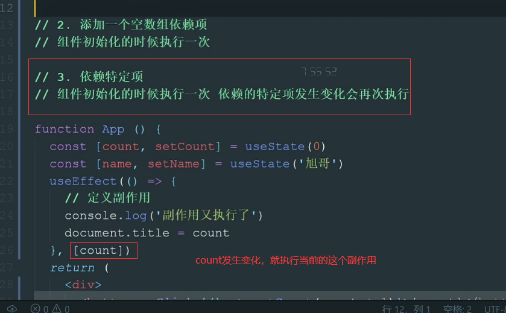
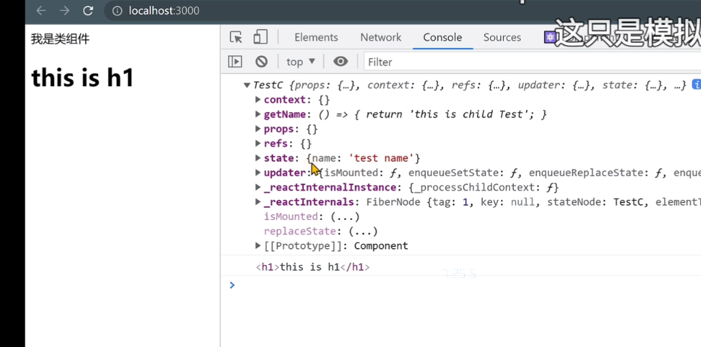

npm换源：npm config set registry http://registry.npmmirror.com

# HOOK

## UseState

UseState 为了使函数组件具有和类组件同样的state功能


## useEffect

对于函数主要做的事情之外，就是副作用




## 自定义


### useLocalmemory


## useEffect清理副作用


## useEffect网络请求


## useRef 获取实例




## useContext 跨级传数据


## Provider位置


放在index.js value改不了，静态的

放在app.js value可以改，动态的

# 路由嵌套


默认渲染的二级路由


# Mobx


## 计算属性


## 模块化，包装Store（mobx）


使用


## 总结


# PC项目

## 介绍


## 搭建


### scss预处理器


### 路由配置


```js
function App() {
  return (
      // 路由配置
      <BrowserRouter>
          <div className="App">
              <Routes>
                  {/*路由对应关系和组件对应关系*/}
                  <Route path="/" element={ <Layout /> }></Route>
                  <Route path="/login" element={ <Login /> }></Route>
              </Routes>
          </div>
      </BrowserRouter>
  );
}
```


### antd

```
yarn add antd
```


### 配置别名路径


```
yarn add -D @craco/craco
```

craco.config.js

* ```js
  const path = require("path")
  module.exports = {
      // webpack 配置
      webpack: {
          alias: {
              '@': path.resolve(__dirname, "src")
          }
      }
  }
  ```

  

* 
* 

效果：


### @路径提示


jsconfig.json

* ```json
  {
    "compilerOptions": {
      "baseUrl": "./",
      "paths": {
        "@/*": ["src/*"]
      }
    }
  }
  ```

  


## 登录模块

#### 结果搭建


#### 封装http


```
yarn add axios
```

http.js

* ```js
  // 封装axios
  import axios from "axios";
  
  const http = axios.create({
      baseURL: "http://geek.itheima.net/v1_0",
      timeout: 5000
  })
  
  // 请求拦截器
  http.interceptors.request.use((config) => {
      return config
  }, (error) => {
      return Promise.reject(error)
  })
  
  // 响应拦截器
  http.interceptors.response.use((response) => {
      return response
  }, (error) => {
      return Promise.reject(error)
  })
  
  export {http}
  ```

#### 配置Mobx


安装

```
yarn add mobx mobx-react-lite 
```


# to be continue: token持久化

